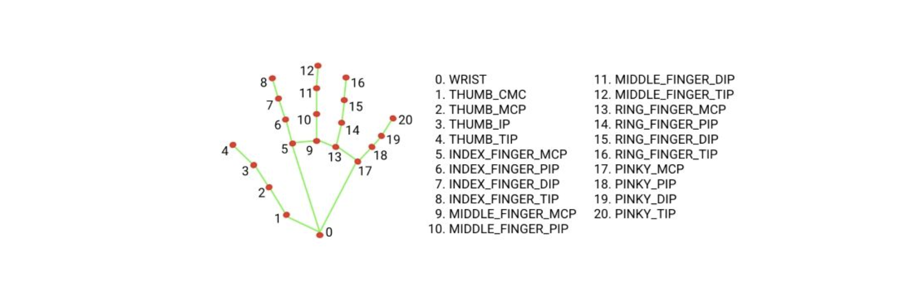

# Quellen

## Idea
- [Google Pixel Wall](https://www.enttec.com/solution/google-pixel-wall/)

## CSS
- [How to create neon text with CSS](https://css-tricks.com/how-to-create-neon-text-with-css/)
- [Creating glow effects with CSS](https://codersblock.com/blog/creating-glow-effects-with-css/)

## HTML
- [Three.js Manual: Installation](https://threejs.org/manual/#en/installation)
- [Three.js Handtracking Example](https://github.com/collidingScopes/threejs-handtracking-101/blob/main/index.html)
- [Mirrored Video](https://stackoverflow.com/questions/14455844/is-that-possible-to-make-video-mirrored#:~:text=horizontally%20or%20vertically)

## JavaScript

### Basic Scene and Pixel Wall
- [Three.js Manual: Creating a Scene](https://threejs.org/manual/#en/creating-a-scene)
- [Orbit Controls Example](https://sbcode.net/threejs/orbit-controls/#:~:text=%2F%2F%20controls,%2F%2F%20up%20arrow)
- [Multiple Cubes from Pixel Color Data](https://stackoverflow.com/questions/33385952/making-multiple-cubes-from-looping-through-getimagedata-pixel-color-data-in-thre#:~:text=for%20,4)
- [Pixelate an Image in JavaScript](https://img.ly/blog/how-to-pixelate-an-image-in-javascript/#:~:text=%2F%2F%20extracting%20the%20position%20of,originalImageData%5BpixelIndexPosition%20%2B%203%5D%7D)

### Hand Tracking
- [3D Hand Controller with MediaPipe and Three.js](https://tympanus.net/codrops/2024/10/24/creating-a-3d-hand-controller-using-a-webcam-with-mediapipe-and-three-js/#:~:text=constructor%28videoElement%2C%20onResultsCallback%29%20,5)
- [JavaScript Controlling Web Page with Gestures](https://www.moravio.com/blog/javascript-controlling-web-page-with-gestures#:~:text=%60const%20hands%20%3D%20new%20Hands%28,maxNumHands%3A%201%2C%20%C2%A0modelComplexity%3A%200%2C%7D%29%3Bhands.onResults%28onResults)
- [Gesture Detection for Emojis](https://github.com/bdekraker/gesture-detection-emojis)
- [CodePen Emoji Example](https://codepen.io/awrigh01/pen/bGNjamV)
- [CSDN Blog: heart emoji drop Example](https://blog.csdn.net/m0_69824302/article/details/148017502#:~:text=setTimeout%28%28%29%20%3D)

---

## Hand Landmarks 

